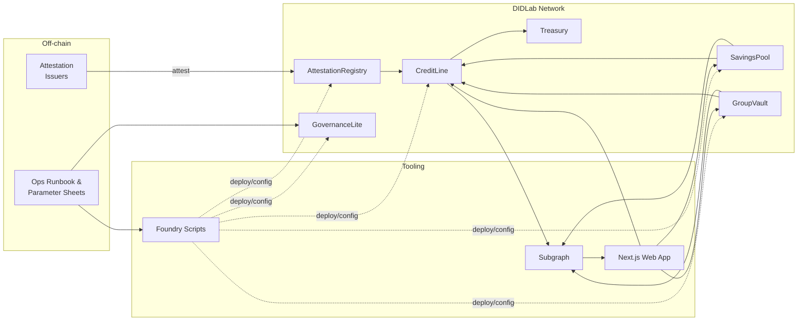

# DIDLab Microfinance – Joint-Liability Lending MVP

A full-stack reference implementation of Grameen-style group lending on the DIDLab Trust network. The repository bundles Solidity contracts, a The Graph subgraph, deployment scripts, thorough documentation, and a Next.js pilot web app so that product, protocol, and operations teams can work from a single source of truth.

> **Mission:** unlock transparent, savings-first credit for small groups through shared incentives, verifiable attestations, and low-cost on-chain rails.

## Table of Contents

- [Overview](#overview)
- [System Architecture](#system-architecture)
- [Repository Structure](#repository-structure)
- [Quick Start](#quick-start)
- [Environment Variables](#environment-variables)
- [Local Development Workflows](#local-development-workflows)
  - [Smart Contracts](#smart-contracts)
  - [Frontend (Next.js)](#frontend-nextjs)
  - [Subgraph](#subgraph)
- [Testing & Quality Gates](#testing--quality-gates)
- [Deployment](#deployment)
- [Documentation Index](#documentation-index)
- [Community & Contributing](#community--contributing)

## Overview

DIDLab Microfinance follows a "savings before credit" philosophy inspired by Grameen Bank. Borrowers join small groups, prove consistent savings, and backstop each other through joint liability and slashable stake. Governance and emergency controls are designed for pilot rollouts on DIDLab (Chain ID 252501).

Key goals:

- **Transparent credit rails** – permissioned issuance with verifiable attestations instead of opaque off-chain ledgers.
- **Savings discipline** – enforce weekly deposits and streak tracking before unlocking loans.
- **Group accountability** – social collateral through stake locking, approval quorums, and slashable exposure.
- **Operational readiness** – scripted deployments, subgraph analytics, and documentation for field teams.

## System Architecture



See [`docs/architecture.md`](docs/architecture.md) for deeper component notes and data flow descriptions.

## Repository Structure

```
contracts/    Solidity sources (Foundry)
script/       Deployment & parameter seeding scripts
app/          Next.js web app (wagmi + viem)
subgraph/     The Graph schema & mappings
docs/         Operational docs, parameters, threat model, knowledge base
presentation.md  Executive brief for stakeholders
```

## Quick Start

```bash
# Install the Foundry toolchain
curl -L https://foundry.paradigm.xyz | bash
~/.foundry/bin/foundryup

# Clone and enter the repository
git clone https://github.com/<your-org>/DeFi-SaveTogether.git
cd DeFi-SaveTogether

# Install contract dependencies
~/.foundry/bin/forge install \
  OpenZeppelin/openzeppelin-contracts \
  foundry-rs/forge-std \
  --no-git

# Install frontend dependencies
cd app
npm install
```

## Environment Variables

Create a `.env` file from the template and populate it with your network configuration:

```bash
cp .env.example .env
```

| Variable | Used By | Description |
| --- | --- | --- |
| `DIDLAB_RPC_URL` | Contracts, app | HTTPS RPC endpoint for DIDLab (`https://eth.didlab.org`). |
| `PRIVATE_KEY_DEPLOYER` | Foundry scripts | Deployer private key (never commit this). |
| `SUBGRAPH_HOST` | Subgraph | Graph node host for local development. |
| `LABUSDT_ADDRESS` | Contracts, app | ERC20 stablecoin (LabUSDT) address for deposits and loans. |
| `OWNER_ADDRESS` | Scripts | Governance owner / multisig address. |
| `ATTESTATION_REGISTRY` | App | Optional override when attaching to existing deployments. |
| `NEXT_PUBLIC_DIDLAB_RPC_URL` | App | Client-side RPC for wagmi/viem (defaults to DIDLab). |
| `NEXT_PUBLIC_SUBGRAPH_URL` | App | HTTP endpoint of the deployed subgraph. |
| `NEXT_PUBLIC_CONTRACT_*` | App | Addresses for AttestationRegistry, SavingsPool, GroupVault, CreditLine, GovernanceLite, Treasury. |

## Local Development Workflows

### Smart Contracts

```bash
# From the repository root
~/.foundry/bin/forge build
~/.foundry/bin/forge test -vvv
```

Highlights:

- `CreditLine.sol` enforces attestations, savings streaks, approval quorums, and exposure caps.
- `GroupVault.sol` manages membership, stake locking, approvals, and default slashing hooks.
- `SavingsPool.sol` tracks weekly deposits and streak eligibility.
- `GovernanceLite.sol` centralizes rate, exposure, and emergency pause parameters.

Inspect `test/` for unit tests and invariants, and extend them as business logic evolves.

### Frontend (Next.js)

```bash
cd app
npm run dev        # http://localhost:3000
npm run lint       # Type checking + linting
npm run build      # Production build
```

Pages cover onboarding, savings flows, group creation, loan approvals, repayments, and admin guardrails. The app uses wagmi/viem and the generated contract ABIs from Foundry artifacts.

### Subgraph

```bash
cd subgraph
npm install          # once
npm run codegen
npm run build
npm run deploy -- --product hosted-service <slug>  # or your preferred graph node
```

Handlers map events emitted by the SavingsPool, GroupVault, and CreditLine contracts to entities used by the frontend and dashboards.

## Testing & Quality Gates

- **Foundry** – unit/property tests under `test/` (`forge test`).
- **Static analysis** – extend with `forge fmt`, `forge snapshot`, and `slither` as you harden the protocol.
- **Frontend** – `npm run lint` ensures TypeScript and ESLint coverage.
- **Subgraph** – `npm run test` (add matchstick tests) and CI builds as the schema evolves.

Integrate these commands in CI/CD to block regressions before deployment.

## Deployment

1. Export the required environment variables (see `.env.example`).
2. **DIDLab evaluation:** follow the mandatory checklist in [`docs/didlab-deployment.md`](docs/didlab-deployment.md) and capture the artefacts needed for the LMS project update.
3. Deploy contracts to DIDLab when preparing evaluation submissions:
   ```bash
   forge script script/00_deploy_all.s.sol \
     --rpc-url https://eth.didlab.org \
     --broadcast \
     --legacy \
     --with-gas-price 2gwei
   ```
   Record contract addresses, transaction hashes, and interaction receipts on https://explorer.didlab.org.
4. Run `forge script script/01_seed_params.s.sol --rpc-url https://eth.didlab.org --broadcast --legacy --with-gas-price 2gwei` to whitelist the issuer in `AttestationRegistry`.
5. Record the emitted addresses in `script/addresses.json` (now populated) and distribute them to the frontend + subgraph teams.
6. Run the smoke tests and operational guidance in [`docs/runbook.md`](docs/runbook.md).
7. Capture artefacts for the LMS submission (transactions, ABI references, commit hash) as outlined in [`docs/didlab-deployment.md`](docs/didlab-deployment.md).

## Documentation Index

- [`docs/architecture.md`](docs/architecture.md) – High-level architecture and data flow diagrams.
- [`docs/project-docs/`](docs/project-docs/index.md) – Deep-dive guides for getting started, contracts, subgraph, frontend, deployment, and governance.
- [`docs/params.md`](docs/params.md) – Default parameter catalog.
- [`docs/threat-model.md`](docs/threat-model.md) – Risk analysis and mitigations.
- [`docs/runbook.md`](docs/runbook.md) – Step-by-step deployment and operational playbooks.
- [`presentation.md`](presentation.md) – Executive summary for stakeholder briefings.

## Community & Contributing

Pull requests and issues are welcome! Please:

1. Fork the repository and create a feature branch.
2. Keep commits scoped and include tests or documentation updates.
3. Run the relevant test suite(s) before opening a PR.
4. Describe context and validation steps in the PR summary.

For questions or collaboration, open an issue or reach out to the maintainers listed in [`docs/project-docs/index.md`](docs/project-docs/index.md).
