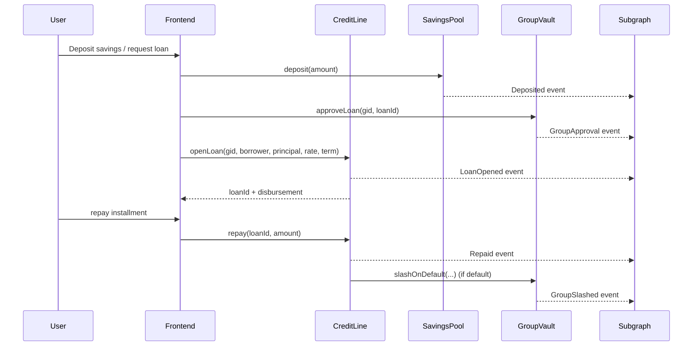

# Architecture Overview

This document expands on the high-level diagram in the repository README. It explains how the smart contracts, subgraph, and frontend collaborate to deliver joint-liability lending on Linea.

## Component Summary

### On-Chain Contracts (`contracts/`)

| Contract | Responsibility | Notable Safeguards |
| --- | --- | --- |
| `AttestationRegistry.sol` | Maintains an allowlist of attesters and the attestation level for each borrower. | Only whitelisted issuers can attest; read-only helper `isEligible` is used to gate loan origination. |
| `SavingsPool.sol` | Handles weekly USDC deposits and streak tracking for borrowers. | Uses calendar week indexes to prevent multiple deposits per period and records consecutive streaks for eligibility. |
| `GroupVault.sol` | Manages group membership, stake custody, and approval quorums for loan requests. | Enforces minimum approval counts, tracks stake balances, and exposes `slashOnDefault` for the credit line. |
| `CreditLine.sol` | Opens loans, tracks repayments, marks defaults, and enforces borrower/group guard rails. | Requires attestations, savings streaks, approval quorums, rate/term bounds, one active loan per borrower, and group exposure caps. |
| `Treasury.sol` | Collects platform fees and forwards funds to governance-owned wallets. | Only callable by the credit line; fees are swept to a governance-controlled address. |
| `GovernanceLite.sol` | Stores protocol parameters and exposes pause/unpause controls. | Access-controlled setters with events for auditability; integrates with `Pausable` to freeze state-changing flows. |

### Deployment Scripts (`script/`)

Foundry scripts (`00_deploy_all.s.sol`, `01_seed_params.s.sol`) deploy the contract suite, wire dependencies, and seed governance parameters from environment variables. `script/addresses.json` records canonical addresses for the frontend and subgraph.

### Subgraph (`subgraph/`)

The Graph indexing package maps emitted contract events to queryable entities:

- `Group` captures membership, stake, and approval thresholds.
- `Loan` and derived `LoanEvent` entities capture the lifecycle of each credit line (opened, repaid, rescheduled, defaulted).
- `SavingsStat` tracks consecutive deposit streaks for frontend eligibility checks.

Run `npm run codegen` to regenerate types, `npm run build` for compiled mappings, and `npm run deploy` to publish to your Graph node or hosted service.

### Frontend (`app/`)

The Next.js application provides the pilot user experience:

- Uses wagmi/viem to read ABIs from Foundry artifacts.
- Exposes pages for onboarding, savings, group formation, loan approvals, repayments, and admin controls.
- Consumes the subgraph for read models and uses environment variables for network switching.

## Data Flow

## Operational Touchpoints

- **Governance updates**: Admins call setters on `GovernanceLite` to tweak parameters such as rates, exposure caps, or savings streak requirements.
- **Emergency pause**: Governance can halt state-changing functions via `GovernanceLite.pause()` while leaving read access intact.
- **Stakeholder reporting**: The subgraph powers analytics dashboards (PAR30, repayment rates) for operations teams.
- **Deployment lifecycle**: Foundry scripts handle Sepolia and Mainnet deployments; addresses feed into the frontend `.env` and subgraph manifest.

For deployment procedures, see [`docs/runbook.md`](runbook.md). For parameter defaults and rationale, reference [`docs/params.md`](params.md) and the threat analysis in [`docs/threat-model.md`](threat-model.md).
